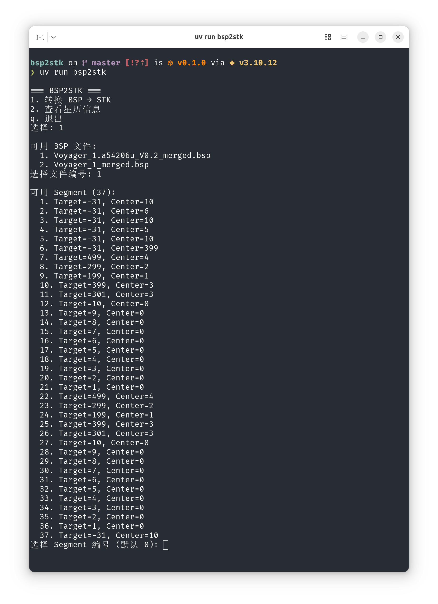
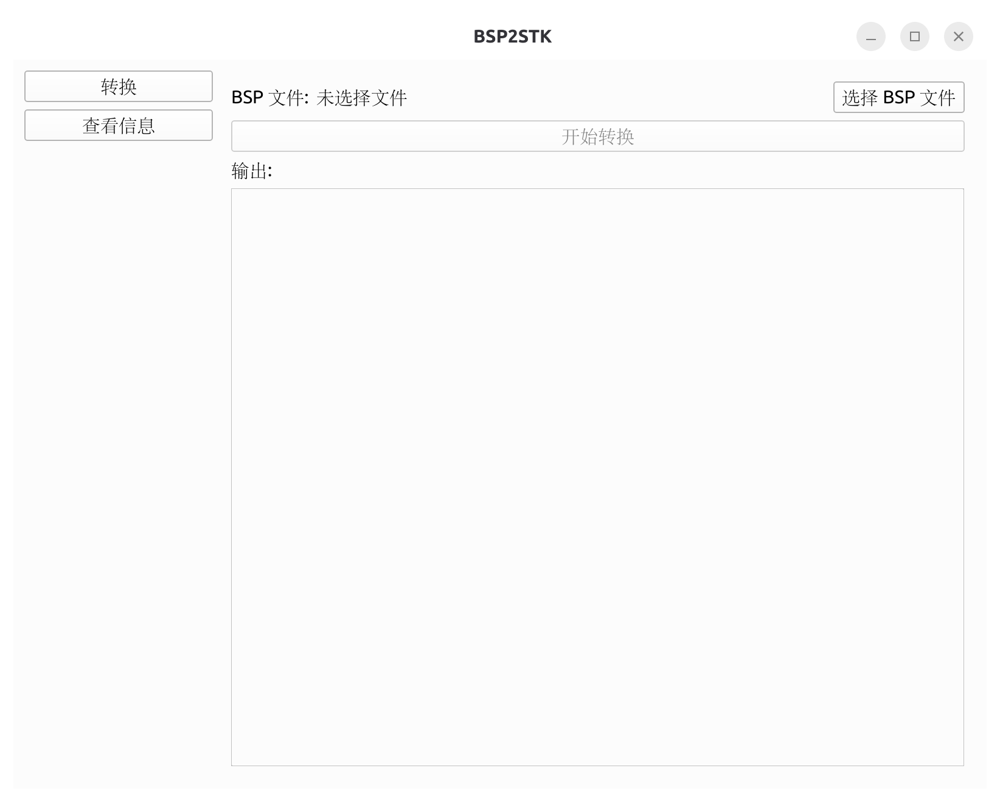

# bsp2stk

BSP 星历文件转 STK 格式转换工具，同时提供 CLI 交互界面和 PyQt6 图形界面，支持 Winodws 和 Linux 。

STK 格式为：
```
stk.v.9.0

BEGIN Ephemeris

    NumberOfEphemerisPoints		 121

    ScenarioEpoch		 13 Feb 2023 00:00:00.000000

# Epoch in JDate format: 2459988.50000000000000
# Epoch in YYDDD format:   23044.00000000000000


    InterpolationMethod		 Lagrange

    InterpolationSamplesM1		 5

    CentralBody		 Earth

    CoordinateSystem		 J2000

# Time of first point: 14 Feb 2023 00:00:00.000000000 UTCG = 2459989.50000000000000 JDate = 23045.00000000000000 YYDDD

    EphemerisTimePosVel

 8.6400000000000000e+04  4.1144475636834656e+06  3.8117720687725376e+06  3.0265875408293619e+06 -2.7795146794637697e+02  2.9953764501686993e+02  6.1042717849106232e-01


END Ephemeris

```
> 如果需要修改 STK 格式，可以修改 [`src/bsp2stk/core/convert.py`](src/bsp2stk/core/convert.py) 文件中的常量定义（第 9-12 行），包括时间步长（`DEFAULT_STEP_SECONDS`）、插值方法（`INTERPOLATION_METHOD`）、插值阶数（`INTERPOLATION_SAMPLES_M1`）、中心天体（`CENTRAL_BODY`）和坐标系（`COORDINATE_SYSTEM`）。

## 安装

```bash
uv pip install -e .
```

## 使用

### CLI 模式

```bash
uv run bsp2stk
```

交互式菜单：
- `1` — 转换 BSP → STK
- `2` — 查看星历信息
- `q` — 退出



### GUI 模式

```bash
uv run bsp2stk-gui
```



## 目录结构

```
bsp/        # 原始 BSP 星历文件（测试数据）
stk/        # 转换后的 STK 星历文件（输出）
src/bsp2stk/  # Python 包源码
```

## 依赖

- Python >= 3.13
- jplephem — BSP 星历读取
- numpy, scipy — 数据处理
- PyQt6 — 图形界面
